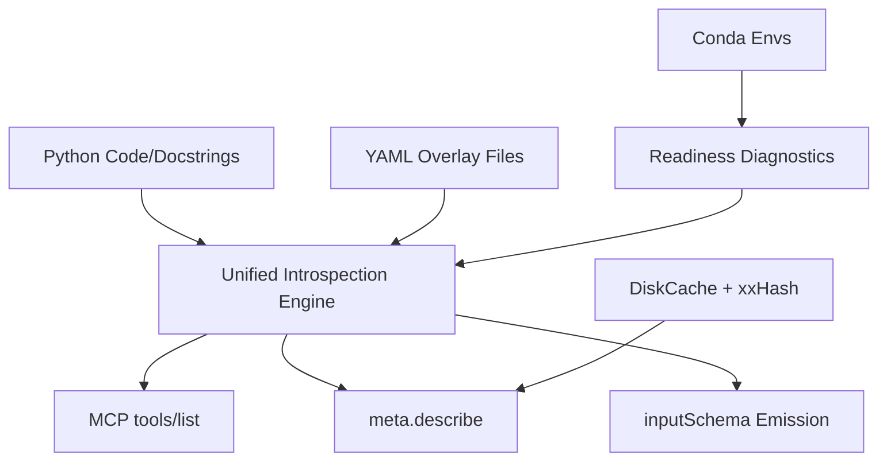

# Feature Landscape: Unified Introspection Engine

**Domain:** AI-driven bioimage analysis MCP server
**Researched:** 2026-01-27

## Table Stakes
Features users and developers expect from an introspection system.

| Feature | Why Expected | Complexity | Notes |
|---------|--------------|------------|-------|
| **Automatic Schema Derivation** | LLMs require valid JSON Schema (MCP `inputSchema`) to call tools accurately. | Medium | Use Pydantic v2 `TypeAdapter` or `model_json_schema` to derive from Python type hints. |
| **AST-First Discovery** | Extract metadata without executing heavy tool dependencies (e.g., PyTorch). | Medium | Use **Griffe** to parse source code statically for signatures and docstrings. |
| **Environment Readiness Diagnostics** | Discovery must know if a tool is *actually* runnable in its conda environment. | Medium | Check for environment existence and package presence before exposing tool. |
| **Consolidated `list` and `describe`** | The MCP `tools/list` and custom `meta.describe` must return identical, consistent metadata. | Medium | Single engine logic serving both endpoints. |

## Differentiators
Features that set this introspection engine apart.

| Feature | Value Proposition | Complexity | Notes |
|---------|-------------------|------------|-------|
| **Two-Stage Pipeline** | Robustly handles both simple pure-Python functions (AST) and complex dynamic factories (Runtime). | High | Stage 1: **Griffe** (Static); Stage 2: Subprocess (Dynamic fallback). |
| **Persistent Schema Cache** | Eliminates re-introspection latency across server restarts. | Low | Use **DiskCache** for high-performance SQLite-backed storage of JSON schemas. |
| **Strong Cache Invalidation** | Ensures zero "stale schema" issues when code or versions change. | Medium | Use **xxHash** to hash source file content as a component of the cache key. |
| **Metadata Overlays (YAML)** | Allows non-Python-devs to improve tool descriptions or set defaults without modifying Python code. | Medium | Merge `tools/{tool}/metadata.yaml` with auto-detected schema. |
| **Actionable Diagnostics** | If a tool fails a readiness check, return the exact `bioimage-mcp install` command needed to fix it. | Low | Use `rich` for formatted CLI instructions. |

## Anti-Features
Features to explicitly NOT build.

| Anti-Feature | Why Avoid | What to Do Instead |
|--------------|-----------|-------------------|
| **Runtime Data Introspection** | Too slow and risky during discovery. | Limit introspection to static signatures and environment readiness. |
| **Direct Binary Introspection** | Generating schemas from C++/Rust binaries without a wrapper is fragile. | Require a thin Python wrapper or manual YAML manifest. |
| **Implicit Type Guessing** | "Guessing" types leads to LLM hallucinations. | Enforce strict type hinting for all registerable tool functions. |

## Feature Dependencies

## MVP Recommendation
1.  **Stage 1 Introspection**: Automatic derivation using Griffe (AST).
2.  **Environment Readiness**: Basic check for tool's conda environment.
3.  **Persistent Caching**: DiskCache integration with xxHash invalidation.
4.  **Consolidated Core**: Single engine serving both CLI and MCP list endpoints.

## Sources
- [Griffe Documentation](https://mkdocstrings.github.io/griffe/)
- [DiskCache Tutorial](http://www.grantjenks.com/docs/diskcache/tutorial.html)
- [Pydantic v2 JSON Schema Docs](https://docs.pydantic.dev/2.12/concepts/json_schema)
- [Model Context Protocol Specification](https://modelcontextprotocol.io/specification/)
