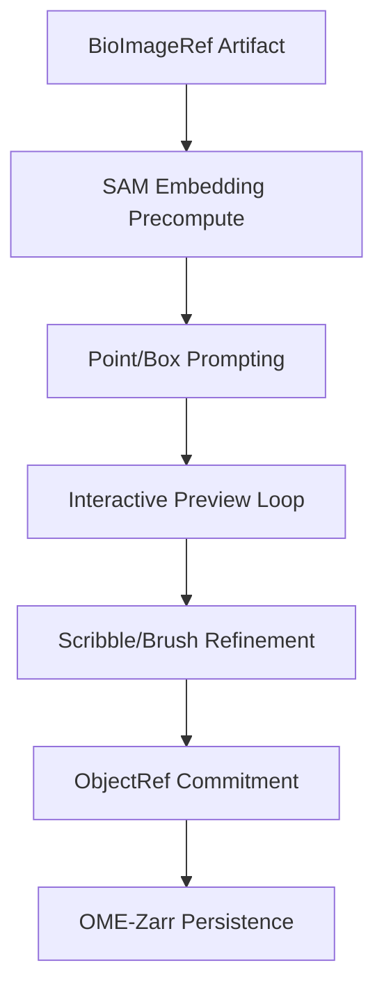

# Features Research: Interactive Annotation

**Domain:** napari + µSAM Interactive Annotation
**Researched:** 2026-02-04
**Overall confidence:** HIGH (Verified via `micro-sam` source and `v0.5.0` project goals)

## User Workflow

The interactive annotation workflow in `bioimage-mcp` v0.5.0 aims to provide a tight loop between user input in napari and µSAM inference on the server.

1.  **Artifact Selection**: The user selects a `BioImageRef` (e.g., a Z-stack or 2D image) from the MCP server.
2.  **Session Initialization**: The user triggers the "Interactive Annotator" via an MCP `run` command. This spawns a napari instance (managed subprocess).
3.  **Embedding Generation**: The server computes image embeddings for the selected image/slice. This is a one-time expensive operation (1-5s depending on GPU) that enables near-instant subsequent interactions.
4.  **Prompting Loop**:
    *   **Point Prompts**: User adds "Positive" (green) points to include areas and "Negative" (red) points to exclude them.
    *   **Box Prompts**: User draws a bounding box around the target object to provide a strong spatial constraint.
    *   **Scribble/Brush**: User paints roughly over the object. These "scribbles" are converted into a mask prompt or a dense set of point prompts (High priority for mask refinement).
5.  **Interactive Preview**: After each prompt update (debounced ~100ms), the MCP server executes µSAM inference using the cached embeddings and the new prompt set. The resulting mask is sent back to napari as a preview layer.
6.  **Commit/Finalize**: Once satisfied, the user "commits" the current mask. The mask is assigned a unique ID in a permanent `Labels` layer and saved as an `ObjectRef` (OME-Zarr format).
7.  **3D Propagation**: For Z-stacks, the user can "propagate" the current slice's mask to adjacent slices to seed the next round of interactive refinement.

## Table Stakes

Must-have features for the interactive annotation to be usable and competitive.

| Feature | Why Expected | Complexity | Notes |
|---------|--------------|------------|-------|
| **Embedding Caching** | Interactivity requires <200ms response. Embeddings take >1s to compute. | Medium | Must handle cache invalidation if image changes. |
| **Point Prompts** | Primary way users interact with SAM. Requires +/- labels. | Low | Maps directly to `micro_sam.inference.predict_from_points`. |
| **Box Prompts** | Efficient for large objects or clusters. | Low | Standard napari Shapes layer integration. |
| **Mask Preview Layer** | Users need to see the result *before* committing. | Medium | Requires efficient transport of mask data (e.g., RLE or low-res). |
| **Artifact Commit** | Save annotations back to the MCP store. | Medium | Integration with existing OME-Zarr artifact system. |

## Differentiators

Features that set this integration apart.

| Feature | Value Proposition | Complexity | Notes |
|---------|-------------------|------------|-------|
| **Scribble Refinement** | More intuitive for complex/concave shapes than points alone. | Medium | Convert napari Labels layer to SAM mask prompts. |
| **Multi-Slice Propagation** | Drastically speeds up 3D volume annotation. | High | Uses the 2D mask of slice $i$ to prompt slice $i+1$. |
| **Remote Launch Bridge** | Seamlessly bridge local napari with remote high-performance GPUs. | High | The core value of `bioimage-mcp` for users without local GPUs. |
| **SAM2/SAM3 Support** | Future-proofing for significantly faster inference and video tracking. | High | `micro-sam` roadmap includes native SAM2/3 support. |

## Anti-Features

Features explicitly excluded from the v0.5.0 scope to ensure stability.

| Anti-Feature | Why Avoid | What to Do Instead |
|--------------|-----------|-------------------|
| **Model Fine-tuning** | Requires large datasets and long training times. | Use high-quality pre-trained µSAM models. |
| **Real-time Video Tracking** | Bandwidth and latency requirements are too high for initial MCP. | Focus on static Z-stacks (3D volumes). |
| **In-browser Canvas** | High development cost; poor performance for large bioimages. | Use napari (native Desktop GUI). |
| **Manual Mesh Editing** | High UI complexity for minimal gain in microscopy. | Use standard pixel-based Label layers. |

## Feature Dependencies

The interactive annotation system builds on the v0.4.0 foundation:

## MVP Recommendation

For the v0.5.0 milestone, prioritize:
1. **Embedding Cache**: Implementation of a transient server-side cache for SAM embeddings.
2. **Point/Box UI**: Basic napari event handlers to capture clicks/boxes and trigger MCP tools.
3. **Labels Sync**: Efficient transfer of the final `Labels` layer back to the MCP `ObjectRef` store.

## Sources

- [micro-sam GitHub Repository](https://github.com/computational-cell-analytics/micro-sam)
- [napari Documentation: Annotating with Labels](https://napari.org/stable/tutorials/annotation/annotate_with_labels.html)
- [micro-sam Annotator Documentation](https://computational-cell-analytics.github.io/micro-sam/)
