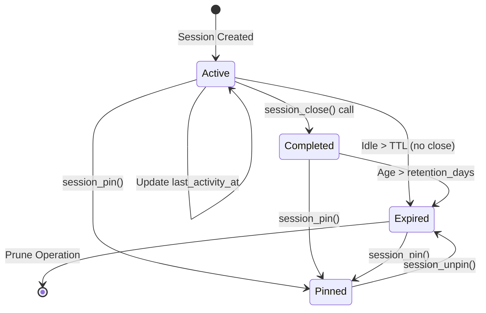

# Data Model: Artifact & Session Management (019)

This document specifies the data model changes for feature `019-artifact-management`, focusing on storage quotas, session lifecycles, and automated cleanup.

## 1. Persistence Layer (SQLite)

The following changes extend the core schema to support artifact ownership and session state tracking.

### 1.1 `sessions` Table Extension

Tracks the lifecycle and protection status of sessions.

| Column | Type | Constraints | Description |
| :--- | :--- | :--- | :--- |
| `session_id` | TEXT | PRIMARY KEY | Unique session identifier |
| `created_at` | TEXT | NOT NULL | ISO 8601 timestamp |
| `last_activity_at` | TEXT | NOT NULL | ISO 8601 timestamp |
| `completed_at` | TEXT | NULL | ISO 8601 timestamp; NULL if active |
| `status` | TEXT | NOT NULL | One of: `active`, `completed`, `failed` |
| `is_pinned` | INTEGER | NOT NULL DEFAULT 0 | 1 (True) if session is exempt from cleanup |
| `connection_hint` | TEXT | NULL | Metadata about the client connection |

### 1.2 `artifacts` Table Extension

Links artifacts to sessions for usage tracking and cleanup.

| Column | Type | Constraints | Description |
| :--- | :--- | :--- | :--- |
| `ref_id` | TEXT | PRIMARY KEY | Unique artifact identifier |
| `session_id` | TEXT | NULL, FK | Refers to `sessions(session_id)`; NULL for global/shared |
| `type` | TEXT | NOT NULL | Artifact type (e.g., `BioImageRef`) |
| `uri` | TEXT | NOT NULL | Storage location URI |
| `format` | TEXT | NOT NULL | File format (e.g., `ome-tiff`) |
| `storage_type` | TEXT | DEFAULT 'file' | `file`, `memory`, or `s3` |
| `size_bytes` | INTEGER | NOT NULL | Size of the artifact on disk |
| `created_at` | TEXT | NOT NULL | ISO 8601 timestamp |
| ... | ... | ... | (Other existing metadata columns) |

## 2. Configuration Model (Pydantic)

New configuration settings for storage management.

### 2.1 `StorageSettings` (Nested Model)

```python
class StorageSettings(BaseModel):
    quota_bytes: int = Field(default=53687091200)       # 50GB default
    warning_threshold: float = Field(default=0.80)      # 80% usage
    critical_threshold: float = Field(default=0.95)     # 95% usage
    retention_days: int = Field(default=7)              # Keep completed sessions
    auto_cleanup_enabled: bool = Field(default=False)   # Enable periodic pruning

    @model_validator(mode="after")
    def validate_thresholds(self) -> StorageSettings:
        if self.critical_threshold <= self.warning_threshold:
            raise ValueError("critical_threshold must be greater than warning_threshold")
        return self
```

## 3. Runtime & CLI Models

Used for reporting status and cleanup results.

### 3.1 `StorageStatus`

Comprehensive view of the artifact store health.

| Field | Type | Description |
| :--- | :--- | :--- |
| `total_bytes` | int | Total capacity (from `quota_bytes`) |
| `used_bytes` | int | Sum of all `size_bytes` in artifacts table |
| `usage_percent` | float | `used_bytes / total_bytes` |
| `by_state` | dict[str, SessionStorageInfo] | Breakdown by lifecycle state |
| `orphan_bytes` | int | Size of files in storage not tracked in DB |

### 3.2 `SessionStorageInfo`

```python
class SessionStorageInfo(BaseModel):
    session_count: int
    artifact_count: int
    total_bytes: int
```

### 3.3 `PruneResult`

Returned by the cleanup/pruning service.

| Field | Type | Description |
| :--- | :--- | :--- |
| `sessions_deleted` | int | Number of session records removed |
| `artifacts_deleted` | int | Number of artifact records removed |
| `bytes_reclaimed` | int | Total disk space freed (bytes) |
| `orphan_files_deleted` | int | Files on disk removed that weren't in DB |
| `errors` | list[str] | Any errors encountered during deletion |

## 4. Session Lifecycle & States

### 4.1 State Definitions

| State | Logic | Behavior |
| :--- | :--- | :--- |
| **Active** | `completed_at` is NULL AND `last_activity_at` < `Config.session_ttl` | Currently editable. Protected from cleanup. |
| **Completed** | `completed_at` is NOT NULL AND age < `retention_days` | Read-only. Protected until retention expires. |
| **Expired** | `completed_at` age > `retention_days` AND `is_pinned == 0` | Eligible for automated deletion. |
| **Pinned** | `is_pinned == 1` | Explicitly protected from all automated cleanup. |

### 4.2 State Transitions



## 5. Migration Strategy

The migration from `0.18` to `0.19` requires updating existing databases.

1.  **Backup**: The server should automatically copy `bioimage_mcp.sqlite3` to `bioimage_mcp.sqlite3.v18.bak`.
2.  **Schema Update**:
    - `ALTER TABLE sessions ADD COLUMN completed_at TEXT DEFAULT NULL`
    - `ALTER TABLE sessions ADD COLUMN is_pinned INTEGER NOT NULL DEFAULT 0`
    - `ALTER TABLE artifacts ADD COLUMN session_id TEXT DEFAULT NULL REFERENCES sessions(session_id)`
3.  **Backfill**: 
    - Existing sessions without a `completed_at` and older than 24 hours (TTL) should be marked as `completed` using their `last_activity_at` as a proxy.
    - Existing artifacts will have `session_id = NULL` (treated as "global/legacy" artifacts).
