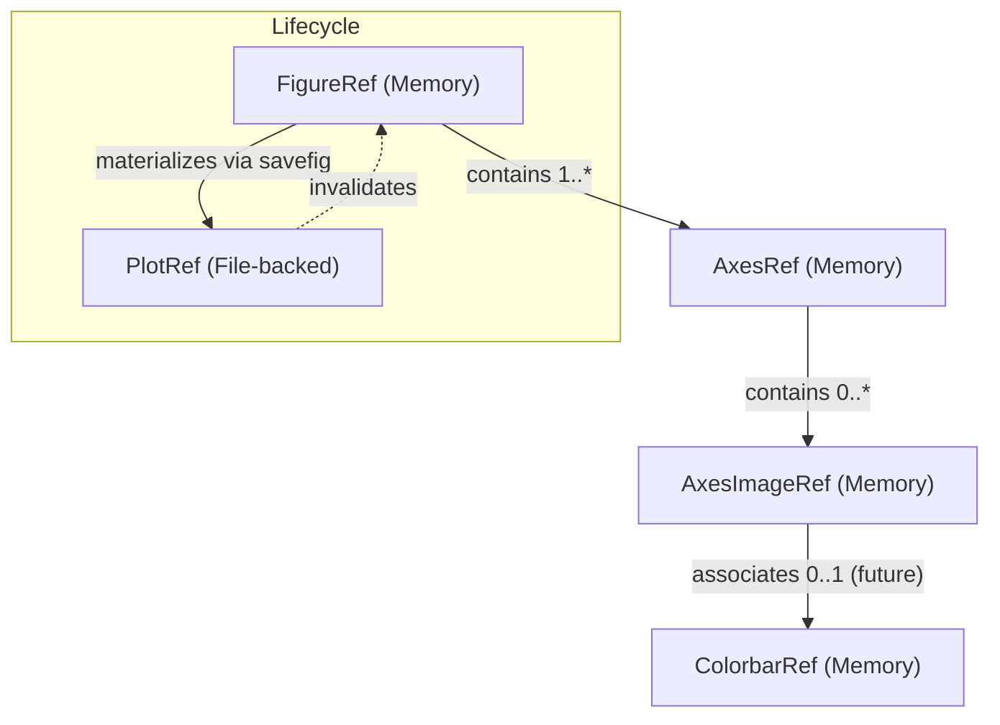

# Data Model: Matplotlib API Integration

This document defines the entities and relationships for the Matplotlib API integration in Bioimage-MCP. It introduces specialized artifact types for managing the lifecycle of in-memory Matplotlib objects and their materialization into file-backed plots.

## Entities

### 1. FigureRef (extends ObjectRef)
An in-memory reference to a Matplotlib `Figure` object. It serves as the top-level container for all plotting elements.

**Fields**:
- `type`: `Literal["FigureRef"]`
- `uri`: `str` (Format: `obj://<session_id>/<env_id>/<artifact_id>`)
- `storage_type`: `"memory"`
- `python_class`: `"matplotlib.figure.Figure"`
- `metadata`: `FigureMetadata`

**FigureMetadata**:
- `figsize`: `tuple[float, float]` - Width, height in inches.
- `dpi`: `int` - Dots per inch (default: 100).
- `facecolor`: `str | None` - Background color.
- `edgecolor`: `str | None` - Edge color.
- `layout`: `str | None` - Layout engine ("constrained", "tight", "compressed").
- `axes_count`: `int` - Number of axes currently in the figure.

---

### 2. AxesRef (extends ObjectRef)
An in-memory reference to a Matplotlib `Axes` object. Most plotting operations (plot, scatter, imshow) occur on an Axes.

**Fields**:
- `type`: `Literal["AxesRef"]`
- `uri`: `str` (Format: `obj://<session_id>/<env_id>/<artifact_id>`)
- `storage_type`: `"memory"`
- `python_class`: `"matplotlib.axes._axes.Axes"`
- `metadata`: `AxesMetadata`

**AxesMetadata**:
- `title`: `str | None` - Current title of the axes.
- `xlabel`: `str | None` - Label for the x-axis.
- `ylabel`: `str | None` - Label for the y-axis.
- `xlim`: `tuple[float, float] | None` - X-axis view limits.
- `ylim`: `tuple[float, float] | None` - Y-axis view limits.
- `xscale`: `str` - Scaling for x-axis ("linear", "log", "symlog", "logit").
- `yscale`: `str` - Scaling for y-axis.
- `aspect`: `str | float` - Aspect ratio ("equal", "auto", or numeric).
- `is_axis_off`: `bool` - Whether axis lines/labels are hidden.
- `parent_figure_ref_id`: `str` - Reference ID of the parent `FigureRef`.

---

### 3. AxesImageRef (extends ObjectRef)
An in-memory reference to a Matplotlib `AxesImage` object, typically returned by `imshow`.

**Fields**:
- `type`: `Literal["AxesImageRef"]`
- `uri`: `str` (Format: `obj://<session_id>/<env_id>/<artifact_id>`)
- `storage_type`: `"memory"`
- `python_class`: `"matplotlib.image.AxesImage"`
- `metadata`: `AxesImageMetadata`

**AxesImageMetadata**:
- `cmap`: `str` - Name of the colormap.
- `vmin`: `float | None` - Minimum value for color normalization.
- `vmax`: `float | None` - Maximum value for color normalization.
- `origin`: `Literal["upper", "lower"]` - Image origin.
- `interpolation`: `str` - Interpolation method used.
- `parent_axes_ref_id`: `str` - Reference ID of the parent `AxesRef`.

---

### 4. PlotRef (Updated)
File-backed artifact representing a rendered visualization. Extended from the initial implementation to support more formats.

**Fields**:
- `type`: `Literal["PlotRef"]`
- `format`: `Literal["PNG", "SVG", "PDF", "JPG"]`
- `uri`: `str` (Format: `file://<path>`)
- `storage_type`: `"file"`
- `metadata`: `PlotMetadata`

**PlotMetadata**:
- `width_px`: `int` - Image width in pixels.
- `height_px`: `int` - Image height in pixels.
- `dpi`: `int` - Resolution used for rendering.
- `plot_type`: `str | None` - Category of plot (e.g., "histogram", "overlay").
- `title`: `str | None` - Figure-level title if applicable.

## Relationships



## State Transitions

1.  **Creation**: Calling `base.matplotlib.pyplot.figure` or `base.matplotlib.pyplot.subplots` creates a new `FigureRef` and associated `AxesRef`(s).
2.  **Modification**: Calling plotting methods (e.g., `base.matplotlib.Axes.imshow`, `base.matplotlib.Axes.plot`) on an `AxesRef` updates its state and may produce new `AxesImageRef` artifacts.
3.  **Materialization**: Calling `base.matplotlib.Figure.savefig` on a `FigureRef` renders the figure to a file, creates a `PlotRef`, and marks the source `FigureRef` as invalid (closed).
4.  **Cleanup**: When a session ends, all remaining `FigureRef` objects in memory are explicitly closed to prevent memory leaks.

## Validation Rules

1.  **Dimensions**: `FigureMetadata.figsize` must contain positive floats.
2.  **Hierarchy**: `AxesRef.parent_figure_ref_id` must reference a valid `FigureRef` within the same session.
3.  **Hierarchy**: `AxesImageRef.parent_axes_ref_id` must reference a valid `AxesRef` within the same session.
4.  **Formats**: `PlotRef.format` must be one of: `PNG`, `SVG`, `PDF`, `JPG`.
5.  **Immutability**: Once a `PlotRef` is created via `savefig`, the source `FigureRef` becomes invalid and cannot be further modified or saved again.

## Pydantic Model Examples

```python
from typing import Literal, Optional
from pydantic import BaseModel, Field

class FigureMetadata(BaseModel):
    figsize: tuple[float, float]
    dpi: int = 100
    facecolor: Optional[str] = None
    edgecolor: Optional[str] = None
    layout: Optional[str] = None
    axes_count: int = 0

class FigureRef(ObjectRef):
    type: Literal["FigureRef"] = "FigureRef"
    python_class: str = "matplotlib.figure.Figure"
    metadata: FigureMetadata

class AxesMetadata(BaseModel):
    title: Optional[str] = None
    xlabel: Optional[str] = None
    ylabel: Optional[str] = None
    xlim: Optional[tuple[float, float]] = None
    ylim: Optional[tuple[float, float]] = None
    xscale: str = "linear"
    yscale: str = "linear"
    aspect: str | float = "auto"
    is_axis_off: bool = False
    parent_figure_ref_id: str

class AxesRef(ObjectRef):
    type: Literal["AxesRef"] = "AxesRef"
    python_class: str = "matplotlib.axes._axes.Axes"
    metadata: AxesMetadata

class AxesImageMetadata(BaseModel):
    cmap: str = "viridis"
    vmin: Optional[float] = None
    vmax: Optional[float] = None
    origin: Literal["upper", "lower"] = "upper"
    interpolation: str = "antialiased"
    parent_axes_ref_id: str

class AxesImageRef(ObjectRef):
    type: Literal["AxesImageRef"] = "AxesImageRef"
    python_class: str = "matplotlib.image.AxesImage"
    metadata: AxesImageMetadata
```
